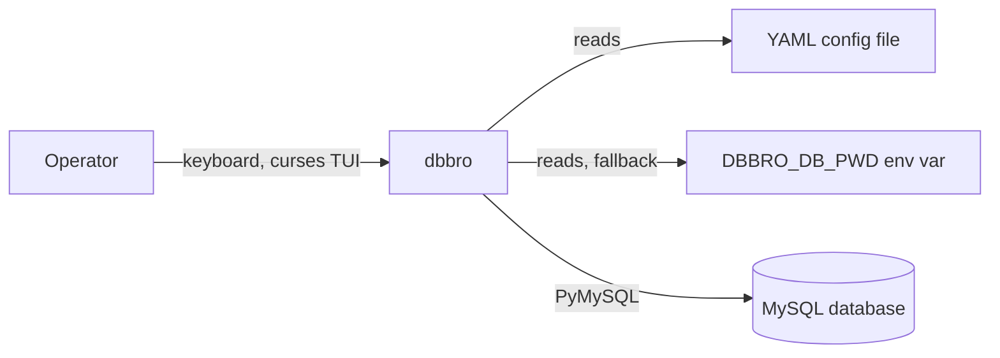
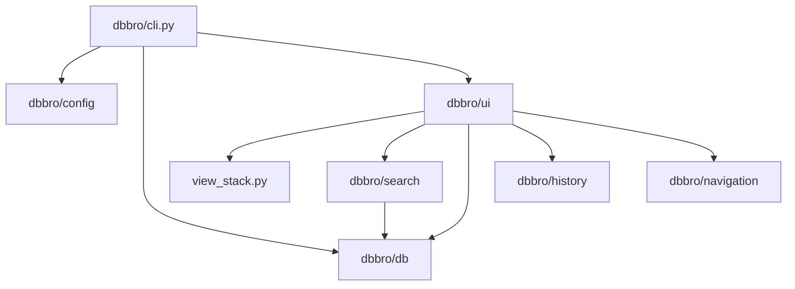

# dbbro

A terminal console application for browsing a relational database whose
schema — tables, columns, searchable columns, primary keys, and relations
between tables — is declared entirely in a YAML configuration file. There is
no generic/free-form query capability: an operator can only search, view,
and navigate the tables, columns, and relations the configuration declares.

## 1. Introduction and goals

- **Purpose** — let an operator search for a specific record by a
  configured (table, column) pair, view its fields as a table, follow
  declared relations to related records, move back/forward through visited
  records, and see a clear error notice when a search or relation lookup
  fails. See `specs/briefing.md` for the original product brief and
  `specs/roadmap.md` for the epic breakdown this was built from.
- **Stakeholders** — not documented in the repository; open point below.

## Setup

### Install

Requires Python >= 3.11 (`pyproject.toml`). From the repo root, using
[`uv`](https://github.com/astral-sh/uv) (a lockfile, `uv.lock`, is
committed):

```bash
uv sync
```

Or with plain `pip`, in a virtualenv:

```bash
python -m venv .venv
source .venv/bin/activate      # Windows: .venv\Scripts\activate
pip install -e .
```

This installs the `dbbro` package and its runtime dependencies: `pyyaml`
(schema config parsing) and `pymysql` (the MySQL client — see §2/§9). No
console-script entry point is currently declared in `pyproject.toml`, so
the app is invoked as a module (see **Run**, below).

### Configure

dbbro needs two things in one YAML file: the browsable **schema** (EP-1)
and the **database connection** (EP-6). Neither is optional — dbbro
validates the schema first, then resolves and establishes the database
connection, refusing to start on any problem with either.

Create a config file, e.g. `config.yaml`:

```yaml
tables:
  Company:
    columns: [id, name, customerNumber, creationDate, uuid, member_id]
    search_columns: [customerNumber, uuid]
    primary_key: id
  Membership:
    columns: [id, member_id, creationDate]
    search_columns: []
    primary_key: id
    relations:
      - table: Company
        local_column: member_id
        foreign_column: id
        label: "belongs to company"

database:
  host: db.example.com
  name: mydb
  user: dbbro_operator
  # password: set here, or omit and use DBBRO_DB_PWD instead (see below)
```

Schema section (`tables`):
- `columns` — every column dbbro is allowed to display for that table.
- `search_columns` — the subset of `columns` an operator can search on
  (may be empty, as for `Membership` above).
- `primary_key` — must be one of `columns`.
- `relations` (optional) — each entry needs `table` (the related table's
  name), `local_column`, `foreign_column`, and a human-readable `label`
  shown when navigating that relation in the UI.

dbbro validates the whole `tables` section in one pass at startup
(`dbbro/config/validate.py`) and reports every problem it finds — e.g.
undeclared columns, duplicate table/column names, a primary key that isn't
a declared column, or a relation naming a table/column that doesn't
exist — before any UI is shown.

Database section (`database`, required):
- `host`, `name`, `user` — required.
- `port` — optional; defaults to MySQL's standard `3306` if omitted.
- `password` — optional in the file. If omitted, dbbro reads it instead
  from the `DBBRO_DB_PWD` environment variable; an empty/unset environment
  variable with no file password is a configuration error, not an empty
  password.

```bash
export DBBRO_DB_PWD='s3cret'   # only needed if `password` is not in the file
```

If the `database` section is missing entirely, missing a required value,
or the connection cannot be established (unreachable host, rejected
credentials), dbbro reports the problem to stderr and exits without
opening the UI (`dbbro/db/database_config.py`, `dbbro/db/connection.py`).
No error message ever includes the resolved password.

### Run

```bash
python -m dbbro.cli --config config.yaml
```

`--config` is the only supported flag; it is required
(`dbbro/cli.py::build_arg_parser`). On success, dbbro validates the schema,
resolves and establishes the database connection (in that order), then
opens the curses UI, starting on the search selection dialog listing every
declared (table, column) search pair. On any failure — schema or
connection — every issue found is printed to stderr and the process exits
with a non-zero status without opening the UI.

## 2. Constraints

- **Language/runtime:** Python, `requires-python = ">=3.11"` (`pyproject.toml`).
- **Dependencies:** `pyyaml` (schema config) and `pymysql` (MySQL client,
  added for EP-6) — the only two runtime dependencies (`pyproject.toml`);
  the terminal UI is built on Python's standard-library `curses` module,
  not a third-party TUI framework.
- **Database engine:** MySQL only, via `PyMySQL`
  (`dbbro/db/connection.py::connect`) — a deliberate choice recorded in
  `specs/6_db_connection_configuration-spec.md`'s decision log, superseding
  an earlier sqlite3-only implementation used by Epics 2/3's own tests.
- **Packaging:** `setuptools`, with the `dbbro` package discovered via
  `[tool.setuptools.packages.find]`.
- **Testing:** `pytest>=8.0` as a dev dependency; no CI workflow is present
  in this repository (no `.github/workflows`).

## 3. Context and scope

**Scope:** a single-operator, terminal-based (curses) client that reads one
YAML configuration file (schema + database connection) and connects to one
MySQL database, letting the operator search, view, and navigate records
interactively.

**Out of scope:** authentication/multi-user access, writing/editing data,
schema migration, reconnect/retry on a dropped connection, and any query
capability beyond exact-match lookups on configured search columns and
declared relations.

**External interfaces:**
- A YAML configuration file, supplied via the required `--config` CLI flag
  (`dbbro/cli.py::build_arg_parser`), declaring both the schema
  (`dbbro/config/models.py`) and the database connection
  (`dbbro/db/models.py::DatabaseConfig`).
- A MySQL connection opened with `pymysql.connect`
  (`dbbro/db/connection.py`), queried through parameterized `SELECT`s
  (`dbbro/db/queries.py`).
- The `DBBRO_DB_PWD` environment variable, as a fallback source for the
  database password.



## 4. Solution strategy

- **Schema-driven, not code-driven:** every table, column, search column,
  primary key, and relation is declared in YAML and validated once at
  startup (`dbbro/config/validate.py`); nothing about the schema is
  hardcoded in the application.
- **Fail fast and completely, in a fixed sequence:** startup validates the
  schema (`ConfigValidationError`, collecting every issue in one pass),
  then — only if that succeeds — resolves and establishes the database
  connection (`DatabaseConfigError` / `DatabaseConnectionError`); neither
  check is combined with the other, and both refuse to proceed to the UI
  on failure (`dbbro/cli.py::main`).
- **Password kept out of the file by convention, not enforcement:** the
  `database.password` YAML key is optional specifically so operators can
  supply it via `DBBRO_DB_PWD` instead (`dbbro/db/database_config.py`).
- **Minimal-dependency TUI:** the interactive UI is built directly on
  stdlib `curses` rather than a widget framework.
- **Pushable/poppable view stack:** all interactive screens (search dialog,
  value prompt, table view, selection list) implement a common `View`
  protocol (`render`, `handle_key`) and are managed as frames on a
  `ViewStack`, so navigation is just pushing and popping views
  (`dbbro/ui/view_stack.py`).
- **Exceptions as the failure-signaling mechanism:** a failed search or
  relation lookup raises a typed exception (`SearchFailedError`,
  `RelationLookupFailedError`), caught in exactly one place in the main
  loop, mirroring how configuration and database errors are handled
  (`dbbro/ui/errors.py`, `dbbro/ui/app.py::dispatch_key`).

## 5. Building block view

- `dbbro/cli.py` — argument parsing (`--config`); runs schema validation,
  then database connection, then hands both `config` and `conn` to the UI.
- `dbbro/config/` — YAML loading (`loader.py`), the `Table`/`Relation`/
  `Config` data model (`models.py`), structural/cross-referential validation
  (`validate.py`).
- `dbbro/db/` — `models.py` (`DatabaseConfig`), `errors.py`
  (`DatabaseConfigError`, `DatabaseConnectionError`), `database_config.py`
  (parses the `database` YAML section and resolves the password),
  `connection.py` (opens the `PyMySQL` connection), `queries.py`
  (`fetch_by_primary_key`, `fetch_by_column_equals` — see §11 for a known
  incompatibility with the MySQL driver).
- `dbbro/search/` — exact-match search lookup (`lookup.py`) and its outcome
  model (`models.py`: `NoMatch` / `SingleMatch` / `MultipleMatches`).
- `dbbro/navigation/` — `Breadcrumb`, tracking the path of table views
  visited since the current search.
- `dbbro/history/` — a pure `History` stack-with-pointer
  (`history.py`, `models.py`) enabling session-scoped Left/Right
  back/forward navigation without repeating a lookup.
- `dbbro/ui/` — the curses-based interactive layer: `view_stack.py`
  (`View`/`Transition`/`ViewStack`), `search_dialog.py`/`search_prompt.py`
  (search flow), `selection_list.py` (multi-match picker), `table_view.py`/
  `fields.py` (record display and relation-following), `modals.py`/
  `errors.py` (error notices), and `app.py` (the main event loop tying all
  of the above together).



## 6. Runtime view

1. **Startup:** `dbbro --config path/to/config.yaml` parses the flag, then
   `cli.py::main` reads and validates the schema (`ConfigValidationError`
   on failure), and — only if that succeeds — resolves the `database`
   section and opens a connection (`DatabaseConfigError` /
   `DatabaseConnectionError` on failure). Any failure prints every issue
   found and exits before the UI is built.
2. **Search:** the curses main loop starts on the search selection dialog,
   listing every (table, column) search pair from the config
   (`dbbro/ui/search_dialog.py`). The operator picks a pair, types a value,
   and on submit `search.lookup.find_matches` runs an exact-match query.
   Zero matches raises `SearchFailedError`; one match builds a `TableView`
   (recorded into `History`); multiple matches open a `SelectionList`.
3. **Relation-follow:** from a `TableView`, pressing Return on a relation
   field re-queries the related table by its foreign column
   (`TableView._follow_selected_field`) and pushes a new `TableView`,
   recording it into `History` and the `Breadcrumb`.
4. **Back/forward:** Left/Right replay already-built `TableView` objects
   from `History` without re-querying the database, except while the
   search value prompt is focused, where they move the text cursor instead
   (`dbbro/ui/app.py::handle_navigation_keys`).

## 7. Deployment view

- No containerization, CI/CD pipeline, or hosting configuration exists in
  this repository (no `Dockerfile`, no `.github/workflows`).
- The application is installed and run locally as a Python package: install
  with `uv`/`pip` (see `pyproject.toml`, `uv.lock`), then invoke
  `python -m dbbro.cli --config <path>`. It requires network access to a
  reachable MySQL server at the configured host/port.

## 8. Cross-cutting concepts

- **Error handling:** three distinct exception families —
  `ConfigValidationError` (schema, startup-time, collects all issues),
  `DatabaseConfigError` / `DatabaseConnectionError` (connection setup,
  startup-time, checked only after schema succeeds), and
  `OperationFailedError` / `SearchFailedError` / `RelationLookupFailedError`
  (runtime, caught centrally in `dispatch_key` and shown as a modal error
  notice that never advances history and never mutates the underlying view).
- **Credential handling:** the database password is never required to live
  in the config file (`DBBRO_DB_PWD` env var fallback), and no error
  message from any of the three exception families ever includes the
  resolved password value (`dbbro/db/database_config.py`,
  `dbbro/db/connection.py`).
- **Immutability:** configuration objects (`Table`, `Relation`, `Config`,
  `DatabaseConfig`) are frozen dataclasses, preventing mutation once loaded.
- **Session-only state:** `History` and `Breadcrumb` are constructed fresh
  per process and hold no persistence path — restarting the app always
  starts with empty history.
- **Key routing:** a single main loop intercepts `s` (reopen search) and
  Left/Right (history navigation) before delegating to the current view's
  `handle_key`, so every view gets these behaviors without individually
  implementing them (`dbbro/ui/app.py`).

## 9. Architecture decisions

- **Decision:** use stdlib `curses` instead of a third-party TUI framework
  (`urwid`, `textual`, `prompt_toolkit`).
  **Rationale:** keeps the dependency footprint minimal and gives direct
  control over box-drawing character rendering.
  **Consequences:** more manual rendering/input-loop code than a widget
  framework would require; see `dbbro/ui/view_stack.py`, `dbbro/ui/app.py`.
- **Decision:** a hand-written DB-API 2.0 query layer instead of an ORM
  (`dbbro/db/queries.py`).
  **Rationale:** table/column names are only known at runtime from the YAML
  config, so there are no static model classes for an ORM to map.
  **Consequences:** query construction is manual, and — since it was
  originally written against `sqlite3` — currently incompatible with the
  `PyMySQL` connection now used in production (see §11).
- **Decision:** validation collects every issue in one pass rather than
  failing on the first error, for both the schema section
  (`dbbro/config/validate.py`) and the `database` section
  (`dbbro/db/database_config.py`) — but the two checks remain sequential,
  not combined, per `specs/6_db_connection_configuration.md`'s decision log.
- **Decision:** `PyMySQL` (MySQL) as the sole supported database engine
  (`dbbro/db/connection.py::connect`), overriding this epic's own spec,
  which had originally recommended staying on `sqlite3` until a real target
  engine was confirmed (`specs/6_db_connection_configuration-spec.md`,
  decision `D1`).
  **Rationale:** the operator/user confirmed MySQL as the actual target.
  **Consequences:** `queries.py` needs updating before real end-to-end
  queries will work (see §11).
- Further epic-level architecture decisions (with alternatives considered
  and rejected) are recorded in `specs/*-spec.md`, each with a `## Decision
  log` section.

## 10. Quality

- **Test suite:** `pytest`, 135 tests passing as of this writing, covering
  configuration validation, database connection configuration, search,
  table view/relation-following, history navigation, and error reporting
  (`tests/`).
- **Test style:** unit tests are written TDD-first per epic, named
  `test_ep<N>_t<M>_<topic>.py`, tracing back to specific acceptance
  criteria in `specs/<N>_*.md`. Database connection tests
  (`tests/test_ep6_*.py`) mock `pymysql.connect` rather than requiring a
  live MySQL server.
- No linter, type-checker, or coverage configuration is present in this
  repository (open point).

## 11. Risks and technical debt

- **Known incompatibility, not yet fixed:** `dbbro/db/queries.py` was
  written and tested against `sqlite3`'s `?` paramstyle and calls
  `conn.execute(...)` directly — a `sqlite3.Connection`-only convenience
  method. A raw `PyMySQL` connection has neither: it requires
  `conn.cursor()` and `%s`-style placeholders. As it stands, dbbro will
  start and connect to a real MySQL database successfully, but any actual
  search or relation-lookup query will fail at runtime. This is called out
  explicitly in `specs/6_db_connection_configuration-spec.md`'s risks
  section as a discovered-during-implementation gap, not a silently
  accepted one.
- `connect()`'s MySQL success path has not been exercised against a real,
  live MySQL server — only against a mocked `pymysql.connect` in tests.
- No CI workflow exists — tests are only run locally / on demand.
- No `Dockerfile` or deployment automation; running the app requires a
  local Python environment with network access to a MySQL server.
- No linter/type-checker is configured, so style and type consistency rely
  on convention alone.

## 12. Glossary

- **Epic** — a numbered unit of product scope (`specs/<N>_*.md` /
  `specs/<N>_*-spec.md`): Epic 1 (Schema Configuration), Epic 2 (Record
  Search), Epic 3 (Entry Table View), Epic 4 (Browsing History), Epic 5
  (Error Reporting), Epic 6 (Database Connection Configuration).
- **View** — one interactive curses screen implementing `render`/`handle_key`
  (`dbbro/ui/view_stack.py`).
- **Breadcrumb** — the path of table views visited since the current
  search (`dbbro/navigation/breadcrumb.py`).
- **History** — the session-scoped back/forward navigation sequence
  (`dbbro/history/history.py`), distinct from the breadcrumb.
- **Search pair** — a (table, column) combination declared searchable in
  the YAML configuration.
- **DatabaseConfig** — the resolved, immutable database connection
  parameters (host, port, name, user, password) built from the config
  file's `database` section and/or `DBBRO_DB_PWD` (`dbbro/db/models.py`).

---

## Open points / Clarifications needed

- Stakeholders and target users beyond "an operator" are not documented —
  confirm if this should be added.
- No CI, linting, or type-checking configuration exists — confirm whether
  this is intentional for the project's current stage or should be added.
- `dbbro/db/queries.py` needs a follow-up fix for MySQL/PyMySQL's cursor
  and `%s` paramstyle before search/relation-lookup queries will actually
  work against the now-default MySQL connection (see §11) — confirm
  priority/timing for this fix.
- `connect()`'s success path is untested against a real MySQL server;
  confirm whether a manual or integration smoke test should be added
  before relying on this in a real deployment.
