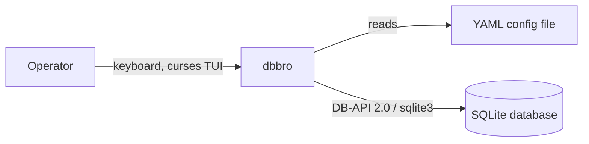
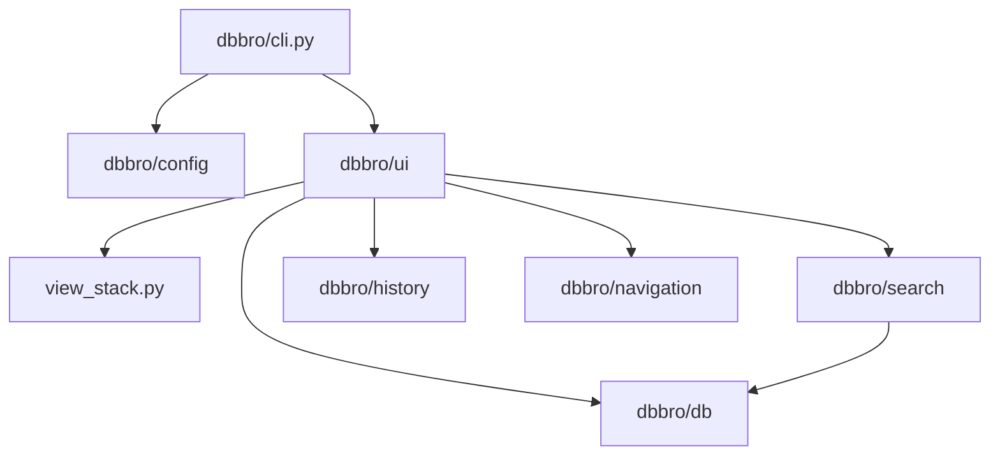

# dbbro

A terminal console application for browsing a relational database whose
schema — tables, columns, searchable columns, primary keys, and relations
between tables — is declared entirely in a YAML configuration file. There is
no generic/free-form query capability: an operator can only search, view,
and navigate the tables, columns, and relations the configuration declares.

## 1. Introduction and goals

- **Purpose** — let an operator search for a specific record by a
  configured (table, column) pair, view its fields as a table, follow
  declared relations to related records, move back/forward through visited
  records, and see a clear error notice when a search or relation lookup
  fails. See `specs/briefing.md` for the original product brief and
  `specs/roadmap.md` for the epic breakdown this was built from.
- **Stakeholders** — not documented in the repository; open point below.

## Setup

### Install

Requires Python >= 3.11 (`pyproject.toml`). From the repo root, using
[`uv`](https://github.com/astral-sh/uv) (a lockfile, `uv.lock`, is
committed):

```bash
uv sync
```

Or with plain `pip`, in a virtualenv:

```bash
python -m venv .venv
source .venv/bin/activate      # Windows: .venv\Scripts\activate
pip install -e .
```

This installs the `dbbro` package and its one runtime dependency,
`pyyaml`. No console-script entry point is currently declared in
`pyproject.toml`, so the app is invoked as a module (see **Run**, below).

### Configure

dbbro has no built-in database schema — you declare it yourself in a YAML
file, then point dbbro at both that file and your database. Every table,
column, searchable column, primary key, and relation must be listed
explicitly; dbbro never inspects the database's real schema.

Create a config file, e.g. `config.yaml`:

```yaml
tables:
  Company:
    columns: [id, name, customerNumber, creationDate, uuid, member_id]
    search_columns: [customerNumber, uuid]
    primary_key: id
  Membership:
    columns: [id, member_id, creationDate]
    search_columns: []
    primary_key: id
    relations:
      - table: Company
        local_column: member_id
        foreign_column: id
        label: "belongs to company"
```

- `columns` — every column dbbro is allowed to display for that table.
- `search_columns` — the subset of `columns` an operator can search on
  (may be empty, as for `Membership` above).
- `primary_key` — must be one of `columns`.
- `relations` (optional) — each entry needs `table` (the related table's
  name), `local_column`, `foreign_column`, and a human-readable `label`
  shown when navigating that relation in the UI.

dbbro validates the whole file in one pass at startup
(`dbbro/config/validate.py`) and reports every problem it finds — e.g.
undeclared columns, duplicate table/column names, a primary key that isn't
a declared column, or a relation naming a table/column that doesn't
exist — before any UI is shown.

### Run

```bash
python -m dbbro.cli --config config.yaml
```

`--config` is the only supported flag; it is required
(`dbbro/cli.py::build_arg_parser`). On success this opens the curses UI,
starting on the search selection dialog listing every declared
(table, column) search pair. On a configuration error, every issue found is
printed to stderr and the process exits with a non-zero status without
opening the UI.

> **Note (open point):** the CLI does not yet expose a flag for the
> database connection itself — `dbbro/ui/app.py::run` currently receives
> `conn=None` from `dbbro/cli.py::run_ui`, since no epic has yet defined
> how the operator supplies a database DSN/path. Until that's added, the
> app starts and lets you browse the search dialog, but any actual lookup
> against a database requires wiring a real `sqlite3` connection in
> (see `dbbro/db/connection.py::connect`).

## 2. Constraints

- **Language/runtime:** Python, `requires-python = ">=3.11"` (`pyproject.toml`).
- **Dependencies:** intentionally minimal — only `pyyaml` at runtime
  (`pyproject.toml`); the terminal UI is built on Python's standard-library
  `curses` module, not a third-party TUI framework.
- **Database access:** standard library `sqlite3` via a thin DB-API 2.0
  wrapper (`dbbro/db/connection.py`), not an ORM.
- **Packaging:** `setuptools`, with the `dbbro` package discovered via
  `[tool.setuptools.packages.find]`.
- **Testing:** `pytest>=8.0` as a dev dependency; no CI workflow is present
  in this repository (no `.github/workflows`).

## 3. Context and scope

**Scope:** a single-operator, terminal-based (curses) client that reads one
YAML configuration file and one SQLite (or other DB-API 2.0) connection,
and lets the operator search, view, and navigate records interactively.

**Out of scope:** authentication/multi-user access, writing/editing data,
schema migration, and any query capability beyond exact-match lookups on
configured search columns and declared relations.

**External interfaces:**
- A YAML configuration file, supplied via the required `--config` CLI flag
  (`dbbro/cli.py::build_arg_parser`), declaring tables, columns, primary
  keys, search columns, and relations (`dbbro/config/models.py`).
- A database connection opened with `sqlite3.connect` (`dbbro/db/connection.py`),
  queried through parameterized `SELECT`s (`dbbro/db/queries.py`).



## 4. Solution strategy

- **Schema-driven, not code-driven:** every table, column, search column,
  primary key, and relation is declared in YAML and validated once at
  startup (`dbbro/config/validate.py`); nothing about the schema is
  hardcoded in the application.
- **Fail fast and completely:** configuration loading collects *every*
  validation issue in one pass and raises a single `ConfigValidationError`
  before any UI is shown, rather than failing on the first problem
  (`dbbro/config/loader.py`, `dbbro/config/errors.py`).
- **Minimal-dependency TUI:** the interactive UI is built directly on
  stdlib `curses` rather than a widget framework, keeping the dependency
  footprint to `pyyaml` alone.
- **Pushable/poppable view stack:** all interactive screens (search dialog,
  value prompt, table view, selection list) implement a common `View`
  protocol (`render`, `handle_key`) and are managed as frames on a
  `ViewStack`, so navigation is just pushing and popping views
  (`dbbro/ui/view_stack.py`).
- **Exceptions as the failure-signaling mechanism:** a failed search or
  relation lookup raises a typed exception (`SearchFailedError`,
  `RelationLookupFailedError`), caught in exactly one place in the main
  loop, mirroring how `ConfigValidationError` is used for configuration
  errors (`dbbro/ui/errors.py`, `dbbro/ui/app.py::dispatch_key`).

## 5. Building block view

- `dbbro/cli.py` — argument parsing (`--config`), loads and validates the
  configuration, then hands off to the UI.
- `dbbro/config/` — YAML loading (`loader.py`), the `Table`/`Relation`/
  `Config` data model (`models.py`), structural/cross-referential validation
  (`validate.py`), and the public `load_config` entry point (`api.py`).
- `dbbro/db/` — a thin DB-API 2.0 layer: `connection.py` opens a `sqlite3`
  connection, `queries.py` provides `fetch_by_primary_key` and
  `fetch_by_column_equals`.
- `dbbro/search/` — exact-match search lookup (`lookup.py`) and its outcome
  model (`models.py`: `NoMatch` / `SingleMatch` / `MultipleMatches`).
- `dbbro/navigation/` — `Breadcrumb`, tracking the path of table views
  visited since the current search.
- `dbbro/history/` — a pure `History` stack-with-pointer
  (`history.py`, `models.py`) enabling session-scoped Left/Right
  back/forward navigation without repeating a lookup.
- `dbbro/ui/` — the curses-based interactive layer: `view_stack.py`
  (`View`/`Transition`/`ViewStack`), `search_dialog.py`/`search_prompt.py`
  (search flow), `selection_list.py` (multi-match picker), `table_view.py`/
  `fields.py` (record display and relation-following), `modals.py`/
  `errors.py` (error notices), and `app.py` (the main event loop tying all
  of the above together).



## 6. Runtime view

1. **Startup:** `dbbro --config path/to/config.yaml` parses the flag, calls
   `config.api.load_config`. On failure, every validation issue is printed
   and the process exits before any UI is built
   (`dbbro/cli.py::main`).
2. **Search:** the curses main loop starts on the search selection dialog,
   listing every (table, column) search pair from the config
   (`dbbro/ui/search_dialog.py`). The operator picks a pair, types a value,
   and on submit `search.lookup.find_matches` runs an exact-match query.
   Zero matches raises `SearchFailedError`; one match builds a `TableView`
   (recorded into `History`); multiple matches open a `SelectionList`.
3. **Relation-follow:** from a `TableView`, pressing Return on a relation
   field re-queries the related table by its foreign column
   (`TableView._follow_selected_field`) and pushes a new `TableView`,
   recording it into `History` and the `Breadcrumb`.
4. **Back/forward:** Left/Right replay already-built `TableView` objects
   from `History` without re-querying the database, except while the
   search value prompt is focused, where they move the text cursor instead
   (`dbbro/ui/app.py::handle_navigation_keys`).

## 7. Deployment view

- No containerization, CI/CD pipeline, or hosting configuration exists in
  this repository (no `Dockerfile`, no `.github/workflows`).
- The application is installed and run locally as a Python package: install
  with `uv`/`pip` (see `pyproject.toml`, `uv.lock`), then invoke
  `dbbro --config <path>` (via the console entry point or
  `python -m dbbro.cli`).

## 8. Cross-cutting concepts

- **Error handling:** two distinct exception hierarchies —
  `ConfigValidationError` (startup-time, collects all issues) and
  `OperationFailedError` / `SearchFailedError` / `RelationLookupFailedError`
  (runtime, caught centrally in `dispatch_key` and shown as a modal error
  notice that never advances history and never mutates the underlying view).
- **Immutability:** configuration objects (`Table`, `Relation`, `Config`)
  are frozen dataclasses, preventing mutation once loaded.
- **Session-only state:** `History` and `Breadcrumb` are constructed fresh
  per process and hold no persistence path — restarting the app always
  starts with empty history.
- **Key routing:** a single main loop intercepts `s` (reopen search) and
  Left/Right (history navigation) before delegating to the current view's
  `handle_key`, so every view gets these behaviors without individually
  implementing them (`dbbro/ui/app.py`).

## 9. Architecture decisions

- **Decision:** use stdlib `curses` instead of a third-party TUI framework
  (`urwid`, `textual`, `prompt_toolkit`).
  **Rationale:** keeps the dependency footprint to `pyyaml` only and gives
  direct control over box-drawing character rendering.
  **Consequences:** more manual rendering/input-loop code than a widget
  framework would require; see `dbbro/ui/view_stack.py`, `dbbro/ui/app.py`.
- **Decision:** a hand-written DB-API 2.0 query layer instead of an ORM
  (`dbbro/db/queries.py`).
  **Rationale:** table/column names are only known at runtime from the YAML
  config, so there are no static model classes for an ORM to map.
  **Consequences:** query construction is manual but limited to two
  functions (`fetch_by_primary_key`, `fetch_by_column_equals`).
- **Decision:** validation collects every issue in one pass rather than
  failing on the first error (`dbbro/config/validate.py`).
  **Rationale:** lets an operator fix all configuration problems in one
  edit-and-retry cycle instead of one-at-a-time.
- Further epic-level architecture decisions (with alternatives considered
  and rejected) are recorded in `specs/*-spec.md`, each with a `## Decision
  log` section.

## 10. Quality

- **Test suite:** `pytest`, 111 tests passing as of this writing, covering
  configuration validation, search, table view/relation-following, history
  navigation, and error reporting (`tests/`).
- **Test style:** unit tests are written TDD-first per epic, named
  `test_ep<N>_t<M>_<topic>.py`, tracing back to specific acceptance
  criteria in `specs/<N>_*.md`.
- No linter, type-checker, or coverage configuration is present in this
  repository (open point).

## 11. Risks and technical debt

- No CI workflow exists — tests are only run locally / on demand.
- No `Dockerfile` or deployment automation; running the app requires a
  local Python environment.
- `dbbro/db/connection.py` targets `sqlite3` specifically in its type hint,
  though the surrounding design intends generic DB-API 2.0 support; no
  other backend has been exercised.
- No linter/type-checker is configured, so style and type consistency rely
  on convention alone.

## 12. Glossary

- **Epic** — a numbered unit of product scope (`specs/<N>_*.md` /
  `specs/<N>_*-spec.md`), e.g. Epic 1 (Schema Configuration), Epic 2
  (Record Search), Epic 3 (Entry Table View), Epic 4 (Browsing History),
  Epic 5 (Error Reporting).
- **View** — one interactive curses screen implementing `render`/`handle_key`
  (`dbbro/ui/view_stack.py`).
- **Breadcrumb** — the path of table views visited since the current
  search (`dbbro/navigation/breadcrumb.py`).
- **History** — the session-scoped back/forward navigation sequence
  (`dbbro/history/history.py`), distinct from the breadcrumb.
- **Search pair** — a (table, column) combination declared searchable in
  the YAML configuration.

---

## Open points / Clarifications needed

- Stakeholders and target users beyond "an operator" are not documented —
  confirm if this should be added.
- No CI, linting, or type-checking configuration exists — confirm whether
  this is intentional for the project's current stage or should be added.
- The database backend is currently exercised only against `sqlite3`;
  confirm whether other DB-API 2.0 backends are an actual near-term goal.
- The CLI has no flag yet for supplying a database connection/DSN (see
  **Setup → Run**) — `run_ui` hardcodes `conn=None`; confirm how/when this
  should be added.
